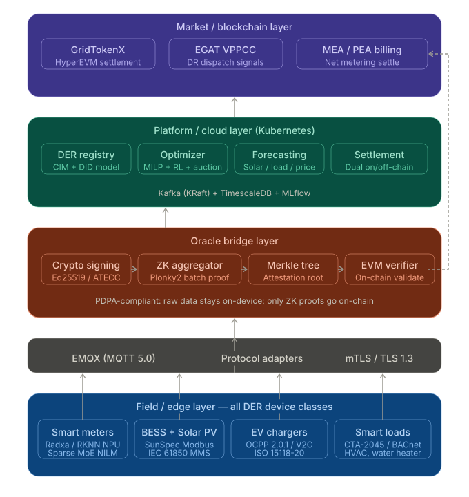
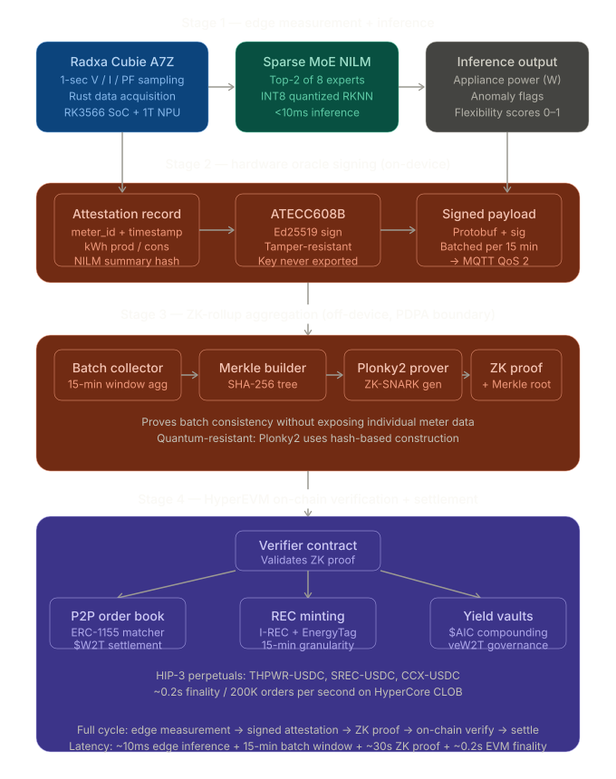

# GridTokenX Oracle Bridge: Core Architecture Overview

This document provides the high-level architectural mapping for the **GridTokenX Oracle Bridge**, showing its role as the critical intermediary between the physical grid assets and the GridTokenX VPP Platform.

---

## 1. Four-Layer System Architecture

The Oracle Bridge sits as a cross-cutting component that connects the physical grid to both the VPP optimization platform and the GridTokenX blockchain settlement layer.

**Operational Workflow**:
Every edge device's data flows up through the communication layer and is ingested by the **Oracle Bridge Service** using the **DLMS/COSEM (IEC 62056)** global data standard for professional partners. The service then branches the data:

- **Path A (Telemetry)**: Sent to the VPP Platform for sub-second optimization and forecasting using a **Zero-Copy** ingestion path.

---

## 2. Oracle Bridge Service Pipeline

The service transforms incoming normalized Protobuf streams into trustworthy on-chain energy data while keeping individual household data private.

**Privacy Boundary**:
The bridge enforces **Privacy-by-Design**. Raw measurement data enters the service but is immediately aggregated into ZK-Rollups. Only the succinct **Plonky2 Proofs** reach the public/consortium blockchain layer, ensuring full PDPA compliance at the structural level.

---

## 3. Edge-to-Service Integration Matrix

The following matrix defines how each DER (Distributed Energy Resource) class interacts with the Oracle Bridge service layer.

| Device Class | Operational Role | Protocol (Northbound) | Service Ingestion Path | Oracle Bridge Role |
| :--- | :--- | :--- | :--- | :--- |
| **All B2C/B2B** | **IEC 62056 Standard** | **DLMS/COSEM** | **ConnectRPC (Port 50051)** | Industrial Ingestion |
| **BESS + Solar PV** | Dispatchable Asset | Modbus / SunSpec | Path A (Real-time Flex) | Production Attestation |
| **EV Chargers** | Bidirectional Load | OCPP 2.0.1 / gRPC | Path A (Session State) | V2G Discharge Verification |

---

## 4. Key Design Principles

- **Global Standard Compliance**: The bridge enforces **DLMS/COSEM (IEC 62056)** as the canonical data model for all professional energy exchange, ensuring 100% accounting fidelity.
- **Zero-Copy Ingestion**: Utilizing `buffa::view::OwnedView` for ultra-low latency Path A telemetry, avoiding unnecessary allocations during Protobuf processing.
- **Bifurcated Tiering**: Separates high-performance industrial gRPC ingestion from mass-market REST-based residential ingestion.

---

## Related Documentation

- [README.md](../README.md) - Service Overview & Tech Stack
- [DATA-FLOW.md](DATA-FLOW.md) - Detailed Ingestion & Proving Flows
- [TELEMETRY.md](TELEMETRY.md) - Path A & VPP Operations Deep Dive
- [ORACLE-BRIDGE.md](ORACLE-BRIDGE.md) - Path B & Trust Aggregation Deep Dive
